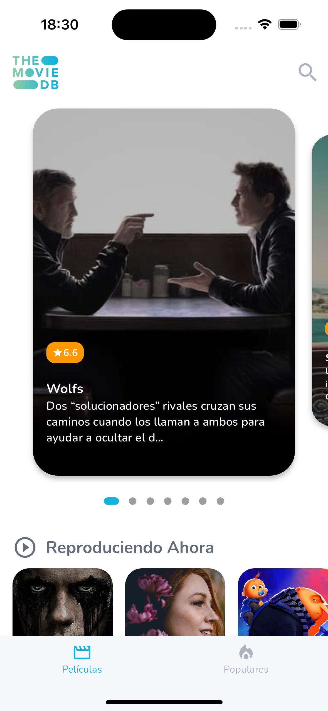
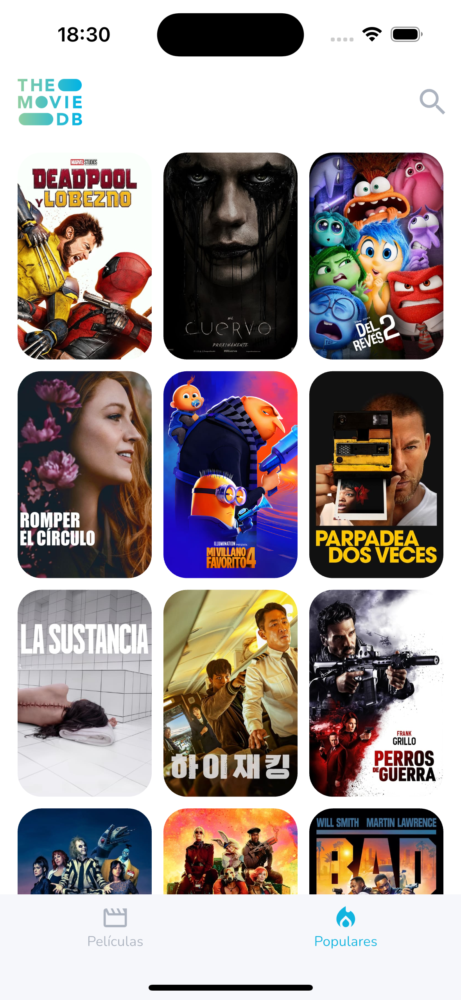

# TMDB Viewer

A Flutter app that allows users to search and view details of movies from The Movie Database (TMDB).
This product is not intended for commercial purposes.
This product uses the TMDB API, image and colors but is not endorsed or certified by TMDB.

## Light Theme Screenshots

  

## Dark Theme Screenshots

  

## Features

- Display a list of movies (Popular, Trending, Top Rated, Upcoming and Now Playing) from TMDB API.
- Search for movies by title and/or genre.
- View detailed information about a selected movie, including title, overview, release date, rating and more.

## Getting Started

### Prerequisites

To run this project, you will need:

- Flutter SDK (v3.x or higher)
- Dart SDK
- Flutter intl plugin
- A valid API key from [TMDB](https://www.themoviedb.org/)

### Installation

1. Clone the repository to your local machine:

   ```bash
   git clone https://github.com/rologr35/tmdb_viewer.git

2. Navigate to the project directory:

   ```bash
   cd tmdb_viewer
   
3. Install the dependencies:

   ```bash
   flutter pub get

4. Add your TMDB API key:

   - Open the lib/res/values/constants.dart file.
   - Replace the `authToken` placeholder with your actual TMDB API key.
   
5. Run the app on your preferred device or emulator:

   ```bash
    flutter run

## Project Structure

The app follows a straightforward structure for easy navigation and understanding:

- `lib/`: Contains the main application code.
    - `app_config/`: Main configuration of routes and pages.
    - `data/`: Repository and API interaction logic, such as fetching data from TMDB.
    - `domain/`: Defines the data models and interfaces.
    - `l10n/`: Internationalization.
    - `res/`: Contains constants shared across the app.
    - `ui/`: Contains the main screens of the app.
    - `utils/`: Contains utilities shared across the app

## Author

**Rolando Govea** – [@rologr35](https://github.com/rologr35)

## License

This project is licensed under the MIT License.